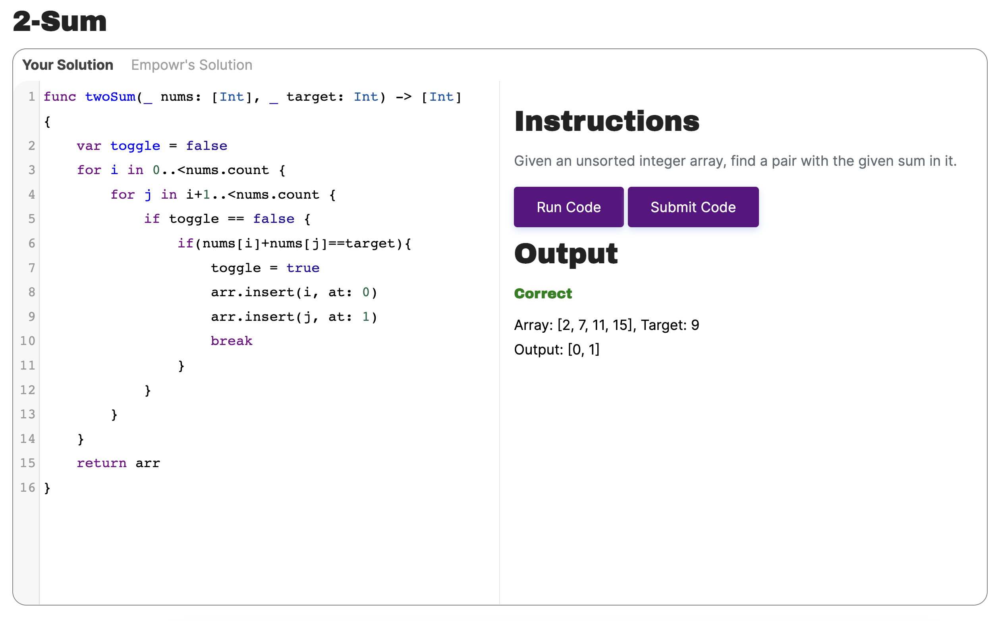

# CodeEditorXblock

An XBlock for Empowr's course platform that allows for the input and checking of any programming language.

<!-- TOC -->
* [CodeEditorXblock](#codeeditorxblock)
  * [TODO](#todo)
  * [Installation](#installation)
    * [Run the Django development server](#run-the-django-development-server)
  * [Supported Languages](#supported-languages)
    * [Adding support for a language](#adding-support-for-a-language)
      * [To find the mime-type](#to-find-the-mime-type)
      * [To find the url](#to-find-the-url)
<!-- TOC -->

## TODO

 - Fix Solution Tab. Most work for a solution tab is done, however it doesn't properly display.
 - Add support for all CodeMirror languages. This is an easy task, just tedious.

## Installation

1. Make sure you have have Python 3.8 installed on your computer.

2. Clone the repo with `git clone --recurse-submodules git@github.com:EmpowrOrg/CodeEditorXblock.git`. This will give
   you the repo including the xblock-sdk submodule.

3. Create and Activate the Virtual Environment:

You must have a virtual environment tool installed on your computer. For more information,
see [Install XBlock Prerequisites](https://edx.readthedocs.io/projects/xblock-tutorial/en/latest/getting_started/prereqs.html)
.

Then create the virtual environment in your CodeEditorXblock directory.

At the command prompt in CodeEditorXblock, run the following command to create the virtual environment.

`virtualenv venv`

Run the following command to activate the virtual environment.

`source venv/bin/activate`

Install the plugin with

`pip install -e swiftplugin`

4. Navigate to the xblock-sdk directory and run the following command to install the requirements.

`pip install -r requirements/base.txt`

### Run the Django development server

Navigate to the xblock-sdk directory and run the following commands.

`make install`

`python manage.py migrate`

`python manage.py runserver`

## Supported Languages

When specifying a language you must put in the correct mime-type for the plugin. Here all the supported languages and
their mime-types

| Language Name | Mime-Type         |
|---------------|-------------------|
| APL           | text/apl          |
| ASN.1         | text/x-ttcn-asn   |
| C             | text/x-csrc       |
| C++           | text/x-c++src     |
| C#            | text/x-csharp     |
| Java          | text/x-java       |
| Kotlin        | text/x-kotlin     |
| Python        | text/x-python     |
| Scala         | text/x-scala      |
| Squirrel      | text/x-squirrel   |
| Swift         | text/x-swift      |
| Objective-C   | text/x-objectivec |

Code Mirror supports many more languages. If you do not see your language supported just check out the
[doc](https://codemirror.net/5/mode/).

### Adding support for a language

It's really simple to add plugin support for
any [language already supported by CodeMirror](https://codemirror.net/5/mode/).
Open  and scroll down to the dictionary of mime-types and
urls.

To add support you need both the mime-type and the url.

#### To find the mime-type
Add the mime-type you wish to add support for. You can find this by looking at the list of supported languages, clicking
on the langauge you want, and then scrolling to the bottom of the page.
Ex: `text/x-kotlin`

#### To find the url
You can find the url needed by going to
the [CodeMirror git folder for their supported modes](https://github.com/codemirror/codemirror5/blob/master/mode/index.html)

Look for the folder name of the language you wish to support.

Ex: If you want to add Kotlin, then you search for Kotlin in the file, and see it's folder name
is `clike`.
Ex:`<li><a href="clike/index.html">Kotlin</a></li>`

Go [here](https://github.com/codemirror/codemirror5/tree/master/mode) and click into the folder name you just discovered
of the language you wish to support.

Notice the name of the `.js` file in this folder.
Ex: If you were adding Kotlin, the js is `clike.js`

Now just append the folder name and the .js name to this
path `https://cdnjs.cloudflare.com/ajax/libs/codemirror/5.65.2/mode/`

The final Url for Kotlin would look like: `https://cdnjs.cloudflare.com/ajax/libs/codemirror/5.65.2/mode/clike/clike.js`

And now you can just add the mime-type and url to the dictionary like
`"text/x-kotlin": "https://cdnjs.cloudflare.com/ajax/libs/codemirror/5.65.2/mode/clike/clike.js",`
